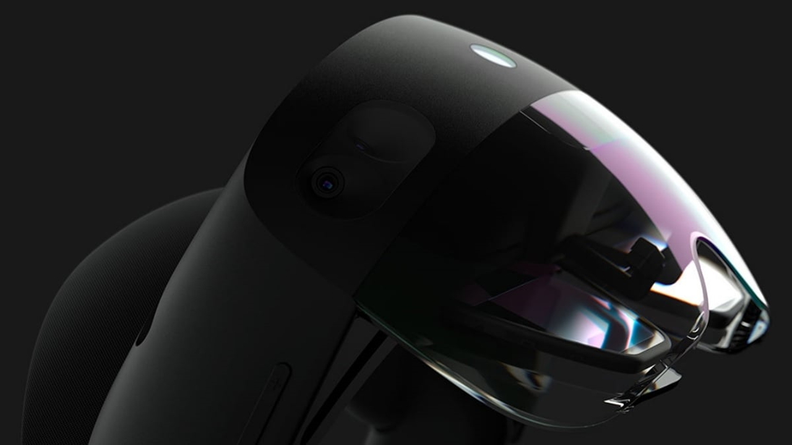
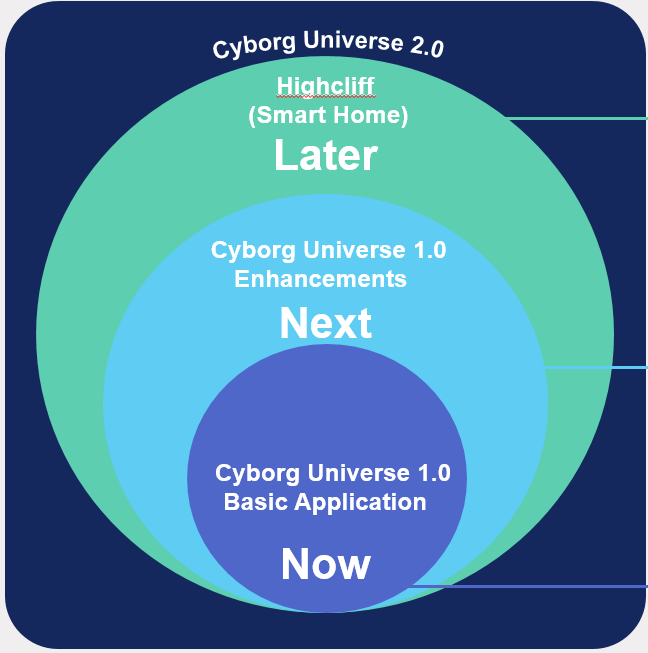

# Scott-Morgan Foundation ## PORTFOLIO

<table>
<tr width=100%>
<td width=40%>

</td>
<td width=60%>
  
### Future Work
To build a fully automated house for a modern family that interfaces directly with Augmented Reality
  
### Coming Up Soon
To integrate advanced features and improve on the performance of the speech synthesizer, art creator, mobility wheelchair, and health tracker 

### Currently Working On
To create an eye-gaze powered application that enables PSM do his day-to-day activities: speech assistant, health tracker, mobility wheelchair, and AI art creator

</td>
</tr>
</table>

Further content to be added..

